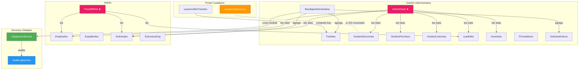

# Análisis Estructural ERP — Solarctec (EcoGest MINEC)

## Resumen Ejecutivo

La estructura general **es sólida y correcta para un ERP modular**. La arquitectura sigue un patrón consistente de separación por capas (`services/`, `hooks/`, `components/`, `constants/`, `utils/`) dentro de cada módulo. Sin embargo, existen **inconsistencias puntuales** y **violaciones a las reglas definidas** que se detallan a continuación.

---

## 1. Cuadro de Conformidad por Módulo

### Gestión Administrativa (GA) — 9 sub-módulos

| Módulo | service/ | hooks/ | components/ | constants/ | utils/ | index.js | Conformidad |
|--------|:--------:|:------:|:-----------:|:----------:|:------:|:--------:|:-----------:|
| **BandejaAdministrativa** | ❌ | ✅ | ✅ (7) | ✅ | ✅ | ✅ | ⚠️ 80% |
| **Tramites** | ✅ | ✅ | ✅ (4) | ✅ | ✅ | ❌ | ✅ 95% |
| **GestionDenuncias** | ✅ | ✅ (3) | ✅ (5) | ✅ | ✅ | ✅ | ✅ 100% |
| **GestionPermisos** | ✅ | ✅ | ✅ (5) | ✅ | ✅ | ❌ | ✅ 95% |
| **GestionLicencias** | ✅ | ✅ | ✅ (5) | ✅ | ✅ | ❌ | ✅ 95% |
| **cuadrillas** | ✅ | ✅ (3) | ✅ (9) | ✅ | ✅ | ✅ | ⚠️ 85% |
| **Inventario** | ✅ | ✅ | ✅ (9) | ✅ | ✅ | ✅ | ✅ 95% |
| **Proveedores** | ✅ | ✅ | ❌ vacío | ✅ | ✅ | ❌ | ⚠️ 75% |
| **SolicitudActivos** | ✅ | ✅ | ✅ (5) | ✅ | ✅ | ✅ | ⚠️ 85% |

### RRHH — 5 sub-módulos

| Módulo | service/ | hooks/ | components/ | constants/ | Conformidad |
|--------|:--------:|:------:|:-----------:|:----------:|:-----------:|
| **Empleados** | ✅ | ✅ | ❌ sin dir | ✅ | ⚠️ 80% |
| **Expedientes** | ✅ | ✅ | ❌ sin dir | ✅ | ⚠️ 80% |
| **Solicitudes** | ✅ | ✅ | ❌ sin dir | ✅ | ⚠️ 80% |
| **EstructuraOrg** | ✅ | ❌ sin hooks | ✅ (vacío) | ✅ | ⚠️ 75% |
| **_shared** | — | — | — | — | ✅ migrador |

### Servicios Globales

| Servicio | Archivo | Patrón correcto | Auditoría |
|----------|---------|:----------------:|:---------:|
| [integracionService](file:///c:/Users/Jumbo%2020%20de%20Julio/Desktop/Solarctec.1.1/src/services/integracionService.js) | `src/services/` | ✅ | ✅ auto |
| [AuditLogService](file:///c:/Users/Jumbo%2020%20de%20Julio/Desktop/Solarctec.1.1/src/services/AuditLogService.js) | `src/services/` | ✅ | — inmutable |

---

## 2. Hallazgos Críticos 🔴

### 2.1 Violaciones de la regla "No localStorage directo en hooks/componentes"

> [!CAUTION]
> La regla del AGENTS.md dice: **"Components and hooks MUST NEVER access localStorage directly. All data access goes through services."** Se detectaron 3 violaciones:

| Archivo | Líneas | Descripción |
|---------|--------|-------------|
| [useActividadCuadrillas.js](file:///c:/Users/Jumbo%2020%20de%20Julio/Desktop/Solarctec.1.1/src/views/GestionAdministrativa/cuadrillas/hooks/useActividadCuadrillas.js#L10-L29) | 10, 19, 29 | Lee/escribe directamente `localStorage` para logs de actividad sin servicio intermedio |
| [useBandejaAdministrativa.js](file:///c:/Users/Jumbo%2020%20de%20Julio/Desktop/Solarctec.1.1/src/views/GestionAdministrativa/BandejaAdministrativa/hooks/useBandejaAdministrativa.js#L38) | 38 | Lee `solicitudesActivos` directamente de `localStorage` en vez de usar `solicitudActivosService` |
| [useSolicitudActivos.js](file:///c:/Users/Jumbo%2020%20de%20Julio/Desktop/Solarctec.1.1/src/views/GestionAdministrativa/SolicitudActivos/hooks/useSolicitudActivos.js#L49-L150) | 49, 54, 150 | Escribe directamente a `solicitudesActivos`, `bitacoraSolicitudes` e `inventarioMinisterio` |

### 2.2 BandejaAdministrativa carece de carpeta `services/`

> [!WARNING]
> La **BandejaAdministrativa** es el agregador central del ERP pero **no tiene su propia carpeta `services/`**. Accede a datos usando `integracionService` + servicios de otros módulos + acceso directo a localStorage. La lógica de agregación debería estar en un servicio dedicado (`bandejaService.js`).

### 2.3 Datos MOCK hardcodeados en PanelRRHH

> [!WARNING]
> [PanelRRHH.js](file:///c:/Users/Jumbo%2020%20de%20Julio/Desktop/Solarctec.1.1/src/views/RRHH/PanelRRHH.js#L80-L153) tiene una lista de trámites RRHH **hardcodeada** como `useState` (6 objetos mock con fechas de 2024-2025). Estos datos no provienen de ningún servicio y no se persisten. En un dashboard de ERP esto contradice el patrón de que **toda data viene del service layer**.

### 2.4 AdminPanel `datosRecientes` es 100% MOCK

> [!WARNING]
> [AdminPanel.js](file:///c:/Users/Jumbo%2020%20de%20Julio/Desktop/Solarctec.1.1/src/views/GestionAdministrativa/AdminPanel.js#L148-L252) contiene `datosRecientes` con 10 registros mock estáticos que nunca se actualizan desde servicios. Las estadísticas globales sí se calculan dinámicamente desde servicios — pero la tabla de "Últimos Registros" es completamente ficticia.

---

## 3. Advertencias ⚠️

### 3.1 Inconsistencias de nombrado (convención `camelCase` vs `PascalCase`)

| Problema | Actual | Esperado |
|----------|--------|----------|
| Carpeta `cuadrillas` | minúscula | `Cuadrillas` (PascalCase, como el resto) |
| Archivo principal `gestionTramites.js` | camelCase | `GestionTramites.js` (PascalCase, componente) |
| `gestionDenuncias.js` | camelCase | `GestionDenuncias.js` |
| `gestionPermisos.js` | camelCase | `GestionPermisos.js` |
| `gestionLicencias.js` | camelCase | `GestionLicencias.js` |

> [!NOTE]
> Los componentes en GA usan `camelCase` para el archivo principal del módulo (`gestionTramites.js`), mientras que en RRHH y en otros módulos GA se usa `PascalCase` (`SolicitudActivos.js`, `Inventario.js`, `Proveedores.js`). La convención del AGENTS.md dice **"Components: export default (PascalCase filenames)"**.

### 3.2 Inconsistencias de export en servicios

| Servicio | Named export | Default export | Según AGENTS.md |
|----------|:------------:|:--------------:|:---------------:|
| `empleadoService` | ✅ `export const` | ✅ `export default` | ⚠️ dual |
| `solicitudService` | ✅ `export const` | ✅ `export default` | ⚠️ dual |
| `expedienteService` | ✅ `export const` | ✅ `export default` | ⚠️ dual |
| `estructuraOrgService` | ✅ `export const` | ✅ `export default` | ⚠️ dual |
| `cuadrillaService` | ✅ `export const` | ❌ | ✅ correcto |
| `tramitesService` | ✅ `export const` | ❌ | ✅ correcto |
| `denunciasService` | ✅ `export const` | ❌ | ✅ correcto |
| `integracionService` | ✅ funciones + const | ✅ `export default` | ⚠️ mixto |

> El AGENTS.md especifica: **"Services: Named exports as object literal"**. Los servicios de RRHH exportan tanto `export const` como `export default`, lo que crea ambigüedad al importar (algunos archivos usan `import empleadoService` y otros `import { empleadoService }`).

### 3.3 Módulo Proveedores — componentes vacíos

[Proveedores.js](file:///c:/Users/Jumbo%2020%20de%20Julio/Desktop/Solarctec.1.1/src/views/GestionAdministrativa/Proveedores/Proveedores.js) (15.7KB) es un archivo monolítico sin componentes extraídos. La carpeta `components/` existe pero está **vacía**. Comparado con módulos como `cuadrillas` (9 componentes) o `Inventario` (9 componentes), esto indica que Proveedores no ha sido refactorizado.

### 3.4 RRHH sin `components/` en la mayoría de módulos

Los módulos `Empleados`, `Expedientes`, y `Solicitudes` **no tienen carpeta `components/`**:
- `listEmpleados.js` = **43KB** → monolítico
- `Expedientes.js` = **55KB** → monolítico
- `listSolicitudes.js` = **46KB** → monolítico
- `perfilEmpleado.js` = **55KB** → monolítico

Estos archivos deberían descomponerse en componentes más pequeños.

### 3.5 SolicitudActivos.js es excesivamente grande

[SolicitudActivos.js](file:///c:/Users/Jumbo%2020%20de%20Julio/Desktop/Solarctec.1.1/src/views/GestionAdministrativa/SolicitudActivos/SolicitudActivos.js) tiene **59KB / 1428 líneas**. Tiene componentes en su carpeta `components/` pero aún retiene demasiada lógica en el archivo principal.

### 3.6 EstructuraOrg sin hooks

[EstructuraOrg](file:///c:/Users/Jumbo%2020%20de%20Julio/Desktop/Solarctec.1.1/src/views/RRHH/EstructuraOrg) no tiene carpeta `hooks/` (ni componentes extraídos). Toda la lógica está en [EstructuraOrg.js](file:///c:/Users/Jumbo%2020%20de%20Julio/Desktop/Solarctec.1.1/src/views/RRHH/EstructuraOrg/EstructuraOrg.js) (26KB).

---

## 4. Lo que está BIEN ✅

### Arquitectura modular correcta
- ✅ Separación clara entre **GA** (backoffice operativo) y **RRHH** (gestión de talento)
- ✅ Cada módulo tiene su propio `services/`, `hooks/`, `constants/`
- ✅ Patrón Service Layer bien definido: `{ success, data, error?, message? }`
- ✅ Todos los servicios usan localStorage con clave propia — sin colisiones

### Integración cross-module
- ✅ **`integracionService`** centraliza toda comunicación GA ↔ RRHH
- ✅ **`AuditLogService`** registra automáticamente toda escritura cross-module
- ✅ Protección de datos sensibles (solo campos necesarios se exponen entre módulos)
- ✅ La BandejaAdministrativa agrega correctamente Trámites + SolicitudActivos + RRHH

### Dashboards agregadores
- ✅ **AdminPanel** lee de 7 servicios para mostrar estadísticas reales
- ✅ **PanelRRHH** lee de `empleadoService`, `solicitudService`, `cuadrillaService`

### Convenciones UI
- ✅ `useToast()` y `useConfirmModal()` usados consistentemente en todos los módulos
- ✅ CoreUI components con patrones uniformes

---

## 5. Diagrama de Arquitectura

---

## 6. Recomendaciones Priorizadas

### 🔴 Prioridad ALTA (violaciones de reglas)

1. **Refactorizar `useActividadCuadrillas.js`** — crear un `actividadCuadrillaService.js` y mover la lógica de localStorage ahí
2. **Refactorizar `useSolicitudActivos.js`** — todo `localStorage` directo debe pasar por `solicitudActivosService.js` (que ya existe pero no se usa para todo)
3. **Refactorizar `useBandejaAdministrativa.js`** — crear `bandejaService.js` o usar `solicitudActivosService` directamente en vez de `localStorage.getItem('solicitudesActivos')`

### 🟡 Prioridad MEDIA (consistencia)

4. **Renombrar carpeta `cuadrillas` → `Cuadrillas`** — consistencia con el resto de módulos
5. **Renombrar archivos principales** de `camelCase` → `PascalCase` para módulos GA (`gestionTramites.js` → `GestionTramites.js`, etc.)
6. **Unificar exports en servicios RRHH** — eliminar `export default` y dejar solo `export const xService = {...}` según la convención
7. **Eliminar datos mock del `PanelRRHH.js`** — reemplazar la tabla de trámites hardcodeada con datos reales de servicios

### 🟢 Prioridad BAJA (mejoras)

8. **Descomponer archivos monolíticos de RRHH** — crear `components/` para `Empleados`, `Expedientes`, `Solicitudes`
9. **Reducir `SolicitudActivos.js`** (1428 líneas) — extraer más lógica a componentes
10. **Agregar `hooks/` a EstructuraOrg** — extraer la lógica de estado del componente
11. **Crear `components/` para Proveedores** — descomponer el archivo monolítico de 15KB
12. **Reemplazar `datosRecientes` del AdminPanel** con datos reales agregados desde servicios
13. **Conectar denuncias del ciudadano** — `denunciasCiudadano` → `denunciasMinisterio` (flujo roto documentado)

---

## Veredicto Final

> **La estructura es correcta al ~85% para un ERP modular.** Los patrones arquitectónicos fundamentales (service layer, hooks, separación de módulos, integración cross-module con auditoría) están bien implementados. Los problemas principales son: (1) violaciones puntuales de la regla de no acceder a localStorage en hooks, (2) archivos monolíticos demasiado grandes en RRHH, y (3) inconsistencias menores de nombrado. Ninguno de estos es un bloqueador arquitectónico — son deudas técnicas manejables.
