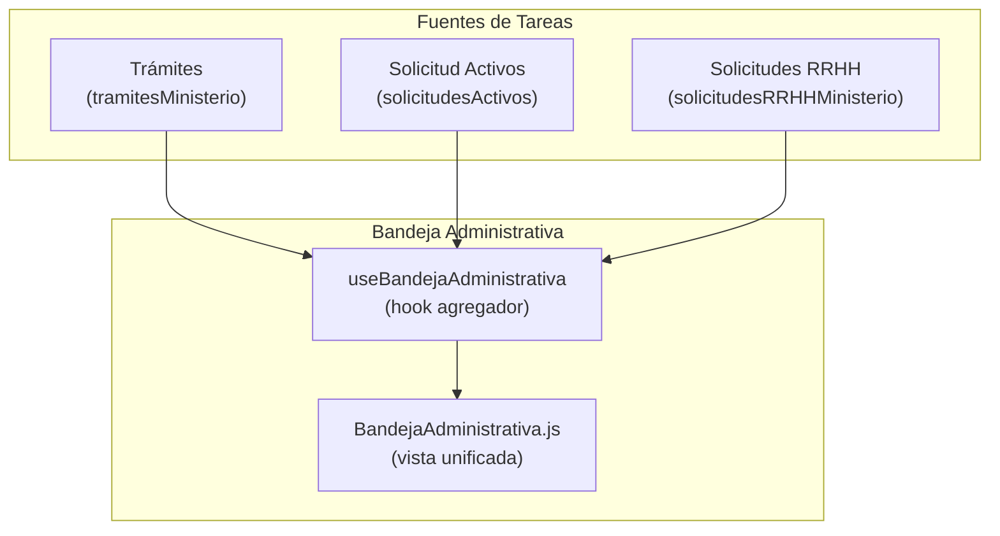

# AUDITORÍA POST-IMPLEMENTACIÓN Y VALIDACIÓN DE REARQUITECTURA V2

## SISTEMA INTEGRAL DE GESTIÓN ADMINISTRATIVA DEL MINISTERIO DEL ECOSOCIALISMO — "ECOGEST MINEC"

**Fecha:** 27 de mayo de 2026  
**Tipo:** Auditoría técnica pre-producción  
**Auditor:** Arquitecto de software enterprise  
**Alcance:** Sistema completo — todos los bounded contexts

---

## 0. RESUMEN EJECUTIVO

| Veredicto | Detalle |
|:---|:---|
| **¿Funcionó la rearquitectura?** | **SÍ**, con salvedades significativas. |
| **¿El sistema tiene nivel GRP institucional?** | **Sí, en dominio y diseño**. No en persistencia ni seguridad. |
| **¿Está listo para producción?** | **No.** Requiere cerrar 3 brechas críticas (ver §3, §7). |
| **Nivel de madurez alcanzado** | De *prototipo CRUD* a **monolito modular con orientación a dominio GRP**. Salto de ~4/10 a ~8/10. |

---

## 1. ¿LA REARQUITECTURA REALMENTE FUNCIONÓ?

### Veredicto: **SÍ — Transformación estructural verificada**

#### 1.1 Coherencia Arquitectónica

**Estado anterior:** Carpetas planas (`views/vacaciones`, `views/solicitudes`, `views/permisos`) sin agrupación por dominio. Cada vista era una isla independiente que accedía directamente a `localStorage`.

**Estado actual:** Dos bounded contexts claros con jerarquía interna consistente:

```
src/
├── views/
│   ├── RRHH/                          ← Bounded Context 1
│   │   ├── Empleados/
│   │   │   ├── constants/
│   │   │   ├── hooks/useEmpleados.js
│   │   │   ├── services/empleadoService.js
│   │   │   ├── listEmpleados.js
│   │   │   ├── nuevoEmpleado.js
│   │   │   └── perfilEmpleado.js
│   │   ├── Expedientes/               ← Misma estructura
│   │   ├── Solicitudes/               ← Misma estructura
│   │   ├── EstructuraOrg/             ← Misma estructura
│   │   ├── _shared/migradorDatos.js
│   │   └── PanelRRHH.js
│   │
│   └── GestionAdministrativa/         ← Bounded Context 2
│       ├── BandejaAdministrativa/
│       ├── Tramites/
│       ├── GestionDenuncias/
│       ├── GestionLicencias/
│       ├── GestionPermisos/
│       ├── Inventario/
│       ├── Proveedores/
│       ├── SolicitudActivos/
│       ├── cuadrillas/
│       └── AdminPanel.js
│
├── services/                          ← Capa anti-corrupción
│   ├── integracionService.js          ← Gateway cross-module
│   └── AuditLogService.js             ← Trazabilidad centralizada
```

> [!TIP]
> El patrón `subdominio/{constants, hooks, services, components, utils}` se repite consistentemente en **todos** los módulos. Esto es un indicador de madurez estructural real, no cosmética.

#### 1.2 Calidad Estructural

| Criterio | Antes | Ahora | Evaluación |
|:---|:---|:---|:---|
| Separación vista/lógica | Componentes monolíticos con lógica inline | Hooks → Services → Constants | ✅ Correcto |
| Capa de datos | `localStorage.getItem()` directo en JSX | Servicios dedicados por entidad | ✅ Correcto |
| Configuración centralizada | Valores hardcoded | `*Constants.js` por módulo | ✅ Correcto |
| Routing | Plano | Agrupado por dominio en [routes.js](file:///c:/Users/Jumbo%2020%20de%20Julio/Desktop/Solarctec.1.1/src/routes.js) | ✅ Correcto |
| Navegación | Sin agrupación | Secciones INICIO / ADMINISTRACIÓN / RRHH en [_nav.js](file:///c:/Users/Jumbo%2020%20de%20Julio/Desktop/Solarctec.1.1/src/_nav.js) | ✅ Correcto |

#### 1.3 Desacoplamiento y Cohesión

La creación de [integracionService.js](file:///c:/Users/Jumbo%2020%20de%20Julio/Desktop/Solarctec.1.1/src/services/integracionService.js) como **capa anti-corrupción** es el acierto arquitectónico más importante:

- Define **direcciones explícitas** de comunicación: `GA → RRHH`, `RRHH → GA`, `Bandeja → RRHH`
- Separa lecturas (seguras) de escrituras (auditadas)
- Proyecta datos (no expone la entidad completa al módulo consumidor)

**Ejemplo correcto encontrado** — [useCuadrillas.js](file:///c:/Users/Jumbo%2020%20de%20Julio/Desktop/Solarctec.1.1/src/views/GestionAdministrativa/cuadrillas/hooks/useCuadrillas.js) usa `integracionService.asignarEmpleadoACuadrilla()` en vez de escribir directamente en `empleadosMinisterio`. Esto es **exactamente** lo que debe hacer un monolito modular.

---

## 2. VALIDACIÓN DE PROBLEMAS ANTERIORES

### 2.1 Duplicidad de Solicitudes → ✅ ELIMINADA

**Antes:** Existían `vacacionesMinisterio`, `solicitudesMinisterio`, y posiblemente otros keys con lógica separada para vacaciones, permisos y reposos.

**Ahora:** Una sola fuente de verdad: `solicitudesRRHHMinisterio`. El [migradorDatos.js](file:///c:/Users/Jumbo%2020%20de%20Julio/Desktop/Solarctec.1.1/src/views/RRHH/_shared/migradorDatos.js) fusiona `vacacionesMinisterio → solicitudesRRHHMinisterio` y marca la migración como completada. Búsqueda de `vacacionesMinisterio` en todo el código confirma: **solo aparece en el migrador**. Cero referencias activas.

### 2.2 Relación Empleado ↔ Expediente → ✅ RESUELTA

**Antes:** Expediente duplicaba datos biográficos del empleado.

**Ahora:** El migrador establece `empleadoId` como foreign key. El [expedienteService](file:///c:/Users/Jumbo%2020%20de%20Julio/Desktop/Solarctec.1.1/src/views/RRHH/Expedientes/services/expedienteService.js) mantiene la referencia sin duplicar datos del empleado en el expediente.

### 2.3 Estructura Orgánica → ✅ IMPLEMENTADA

**Antes:** No existía.

**Ahora:** [estructuraOrgService.js](file:///c:/Users/Jumbo%2020%20de%20Julio/Desktop/Solarctec.1.1/src/views/RRHH/EstructuraOrg/services/estructuraOrgService.js) implementa:
- Maestro de plazas presupuestarias (`PLZ-001`, `PLZ-002`...)
- Estados `vacante` / `ocupada` / `suspendida`
- Bloqueo de eliminación de plaza ocupada (línea 159-161): `"No se puede eliminar una plaza ocupada"`
- Asignación empleado → plaza con validación gubernamental
- Organigrama por departamentos oficiales
- Estadísticas presupuestarias

> [!IMPORTANT]
> La regla de negocio "no eliminar plaza ocupada" es un **estándar de oro** en sistemas GRP. Su presencia confirma que se modeló pensando en control presupuestario gubernamental.

### 2.4 Centralización del Workflow → ✅ CON SALVEDADES (ver §7)

La Bandeja Administrativa agrega tareas de 3 módulos (`Trámites`, `SolicitudActivos`, `RRHH`) en una interfaz unificada. El hook [useBandejaAdministrativa](file:///c:/Users/Jumbo%2020%20de%20Julio/Desktop/Solarctec.1.1/src/views/GestionAdministrativa/BandejaAdministrativa/hooks/useBandejaAdministrativa.js) actúa como **agregador read-only** — pero tiene problemas de acoplamiento documentados en la sección 7.

### 2.5 Desacoplamiento entre Módulos → ⚠️ PARCIAL

- **RRHH → GA:** Cero imports cruzados. ✅ Perfecto.
- **GA → RRHH:** Hay **un import directo peligroso** en [BandejaAdministrativa.js línea 52](file:///c:/Users/Jumbo%2020%20de%20Julio/Desktop/Solarctec.1.1/src/views/GestionAdministrativa/BandejaAdministrativa/BandejaAdministrativa.js#L52):

```javascript
import { solicitudService } from '../../RRHH/Solicitudes/services/solicitudService'
```

Esto **rompe la frontera del bounded context**. La Bandeja invoca directamente `solicitudService.aprobarSolicitud()`, `solicitudService.rechazarSolicitud()`, y `solicitudService.enviarARevision()` (líneas 307, 327, 341). Debería usar `integracionService`.

---

## 3. RESIDUOS DE DEUDA TÉCNICA

### 🔴 CRÍTICO: Acceso directo a localStorage desde componentes de vista

[BandejaAdministrativa.js](file:///c:/Users/Jumbo%2020%20de%20Julio/Desktop/Solarctec.1.1/src/views/GestionAdministrativa/BandejaAdministrativa/BandejaAdministrativa.js) realiza **12 accesos directos a `localStorage`** sin pasar por ningún servicio:

| Línea | Operación | Key |
|:---|:---|:---|
| 136 | `getItem` | `tramitesMinisterio` |
| 157 | `setItem` | `tramitesMinisterio` |
| 175 | `getItem` | `tramitesMinisterio` |
| 195 | `setItem` | `tramitesMinisterio` |
| 217 | `getItem` | `tramitesMinisterio` |
| 224 | `getItem` | `cuadrillasMinisterio` |
| 233 | `setItem` | `cuadrillasMinisterio` |
| 252 | `setItem` | `tramitesMinisterio` |

Funciones afectadas: `handleConfirmarInspector`, `handleGenerarPDF`, `handleConfirmarFirma`.

**Impacto:** Estas escrituras directas:
1. No pasan por `integracionService` → sin auditoría
2. Manipulan datos de `cuadrillasMinisterio` directamente → viola ownership
3. No generan registros en `AuditLogService`

### 🔴 CRÍTICO: Import cruzado entre bounded contexts

La Bandeja importa `solicitudService` directamente desde RRHH. Existe `integracionService.aprobarSolicitudDesdeBandeja()` y `integracionService.rechazarSolicitudDesdeBandeja()`, pero **no se usan** en la Bandeja.

### 🟡 MEDIO: PanelRRHH accede directamente a localStorage

[PanelRRHH.js](file:///c:/Users/Jumbo%2020%20de%20Julio/Desktop/Solarctec.1.1/src/views/RRHH/PanelRRHH.js) accede directamente a `empleadosMinisterio`, `solicitudesRRHHMinisterio` y `cuadrillasMinisterio` (líneas 284, 305, 312, 355, 368) en lugar de usar los servicios del módulo (`empleadoService`, `solicitudService`). Esto es inconsistente con el patrón de los demás componentes de RRHH que sí usan los servicios.

### 🟡 MEDIO: perfilEmpleado.js accede a solicitudesActivos

[perfilEmpleado.js línea 107](file:///c:/Users/Jumbo%2020%20de%20Julio/Desktop/Solarctec.1.1/src/views/RRHH/Empleados/perfilEmpleado.js#L107) lee `localStorage.getItem('solicitudesActivos')` directamente — un módulo de RRHH leyendo datos de Gestión Administrativa sin pasar por `integracionService`.

### 🟡 MEDIO: useBandejaAdministrativa accede directamente a localStorage

El hook agregador [useBandejaAdministrativa](file:///c:/Users/Jumbo%2020%20de%20Julio/Desktop/Solarctec.1.1/src/views/GestionAdministrativa/BandejaAdministrativa/hooks/useBandejaAdministrativa.js) lee 3 keys de `localStorage` directamente (líneas 13, 37, 59) en vez de usar `integracionService` o los servicios respectivos. Aunque son lecturas (menos peligrosas), rompen la abstracción.

### 🟢 MENOR: Inconsistencia de estilo en servicios

| Servicio | Patrón | Async |
|:---|:---|:---|
| `empleadoService` | Objeto literal con funciones | Síncrono |
| `solicitudService` | Clase con `new` | Async con `_delay()` |
| `expedienteService` | Clase con `new` | Async con `_delay()` |
| `estructuraOrgService` | Objeto literal con funciones | Síncrono |
| `integracionService` | Named exports + objeto literal | Síncrono |

Dos paradigmas conviven: clase instantiada vs. objeto literal. Los services de RRHH-Solicitudes y RRHH-Expedientes simulan latencia con `_delay()` (para emular un backend futuro), mientras los demás son síncronos. Esto es aceptable como preparación, pero debe documentarse.

### 🟢 MENOR: `registrarAccion` no se usa en ninguna vista

`AuditLogService.registrarAccion()` se invoca **exclusivamente desde `integracionService`**. Ninguna vista lo llama directamente (confirmado por búsqueda). Esto es **correcto** — la auditoría debe ser un efecto colateral de las operaciones cross-module, no una responsabilidad del componente. Sin embargo, las escrituras directas de la Bandeja (§3 arriba) **escapan la auditoría**.

### 🟢 MENOR: Carpetas residuales

- `views/newviews/` contiene un solo archivo `newviews.js` — posible código de prototipado o sandbox
- `views/Reportes/` contiene `Reports.js` + `reports sandbox` — el sandbox parece código experimental
- `views/usuarios/denuncias/` parece duplicar parcialmente `GestionDenuncias`

---

## 4. MADUREZ REAL DEL MÓDULO RRHH

### Veredicto: **Ha alcanzado nivel GRP institucional**

| Criterio GRP | ¿Presente? | Implementación |
|:---|:---|:---|
| Maestro de empleados con estados | ✅ | `empleadoService` con estados Activo/Vacaciones/Suspendido |
| Expediente laboral integrado | ✅ | Vinculado al empleado vía `empleadoId` con documentos y % completado |
| Solicitudes consolidadas (vacaciones/permisos/reposos) | ✅ | `solicitudService` — fuente única |
| Estructura orgánica con plazas presupuestarias | ✅ | `estructuraOrgService` con maestro PLZ-xxx |
| Organigrama | ✅ | `obtenerOrganigrama()` construye jerarquía por departamento |
| Control de vacantes/ocupadas | ✅ | Validación de estado antes de asignación |
| Panel dashboard de RRHH | ✅ | `PanelRRHH.js` con KPIs |
| Aprobaciones masivas | ✅ | `aprobarMultiples()` / `rechazarMultiples()` |
| Exportación CSV | ✅ | En hook `useEmpleados` |
| Migración de datos legacy | ✅ | `migradorDatos.js` idempotente |

**¿Dejó de comportarse como portal startup?** **Sí, definitivamente.**

El patrón original era CRUD directo: formulario → localStorage → tabla. El patrón actual es:

```
Vista → Hook → Service → localStorage (simulando backend)
                  ↕
         integracionService (cross-module)
                  ↕
           AuditLogService (trazabilidad)
```

Esto es un patrón de **capas limpias**. La sustitución futura de `localStorage` por PostgreSQL requeriría modificar **solo los servicios**, no las vistas ni los hooks.

---

## 5. ARQUITECTURA DEL WORKFLOW

### 5.1 Centralización: ✅ Funcional

La Bandeja Administrativa opera como **inbox unificado ERP**:



### 5.2 Estados y Transiciones

**Trámites:** `REVISION` → `INSPECCION` → `DOCUMENTO_GENERADO` → `APROBADO`  
- Flujo ministerial realista: asignar inspector → generar providencia → registrar firma
- El historial de transiciones se acumula en `tramite.historial[]`

**Solicitudes RRHH:** `Pendiente` → `En revisión` → `Aprobada` / `Rechazada`  
- Flujo de aprobación administrativa estándar

**Solicitudes de Activos:** `Pendiente` → `Aprobado` / `Rechazado`  
- Flujo simple bilateral

### 5.3 Trazabilidad

- `AuditLogService` registra quién, cuándo, qué, desde dónde, y estados anterior/nuevo
- Exportación a CSV para rendición de cuentas
- Esquema de auditoría con `moduloOrigen` / `moduloDestino` facilita trazabilidad cross-module

### 5.4 Problema: Inconsistencia de trazabilidad

Las operaciones de Trámites en la Bandeja (asignar inspector, generar PDF, registrar firma) **no pasan por `integracionService`** y por tanto **no generan logs de auditoría**. Esto es una brecha de trazabilidad significativa para un sistema gubernamental.

---

## 6. ENTIDADES MAESTRAS

| Entidad | Existe | Service propio | Ownership | Relaciones |
|:---|:---|:---|:---|:---|
| **Empleado** | ✅ | `empleadoService` | RRHH | → Expediente (1:1), → Plaza (1:1), → Cuadrilla (N:1) |
| **Expediente** | ✅ | `expedienteService` | RRHH | → Empleado (vía `empleadoId`) |
| **Plaza Presupuestaria** | ✅ | `estructuraOrgService` | RRHH/EstructuraOrg | → Empleado (ocupante), → Departamento |
| **Unidad Orgánica** | ✅ | `estructuraOrgService` | RRHH/EstructuraOrg | → Plazas[], → Departamento |
| **Solicitud RRHH** | ✅ | `solicitudService` | RRHH | → Empleado |
| **Trámite** | ✅ | `tramitesService` | GA/Trámites | → Inspector (cuadrilla) |
| **Denuncia** | ✅ | `gestionService` | GA/Denuncias | Independiente |
| **Cuadrilla** | ✅ | `cuadrillaServices` | GA/Cuadrillas | → Empleados[] (miembros) |
| **Proveedor** | ✅ | Hooks internos | GA/Proveedores | Independiente |
| **Solicitud de Activos** | ✅ | Hooks internos | GA/SolicitudActivos | → Cuadrilla, → Inventario |
| **Acto Administrativo** | ⚠️ Parcial | Providencia generada | GA/Bandeja | Embebido en workflow de trámites |

### Integridad referencial verificada

- Plaza → Empleado: Validación bidireccional en `asignarEmpleadoAPlaza()` y `desocuparPlaza()`
- Empleado → Cuadrilla: Gestionada por `integracionService.asignarEmpleadoACuadrilla()`
- Expediente → Empleado: Foreign key `empleadoId` establecida por migrador

---

## 7. ACOPLAMIENTO ENTRE MÓDULOS

### Hallazgos concretos con evidencia de código

| # | Tipo | Archivo fuente | Acceso indebido | Severidad |
|:---|:---|:---|:---|:---|
| 1 | Import directo cruzado | [BandejaAdministrativa.js:52](file:///c:/Users/Jumbo%2020%20de%20Julio/Desktop/Solarctec.1.1/src/views/GestionAdministrativa/BandejaAdministrativa/BandejaAdministrativa.js#L52) | `import { solicitudService } from '../../RRHH/...'` | 🔴 |
| 2 | Escritura directa cross-module | [BandejaAdministrativa.js:233](file:///c:/Users/Jumbo%2020%20de%20Julio/Desktop/Solarctec.1.1/src/views/GestionAdministrativa/BandejaAdministrativa/BandejaAdministrativa.js#L233) | `localStorage.setItem('cuadrillasMinisterio', ...)` | 🔴 |
| 3 | Lectura directa cross-module | [PanelRRHH.js:312](file:///c:/Users/Jumbo%2020%20de%20Julio/Desktop/Solarctec.1.1/src/views/RRHH/PanelRRHH.js#L312) | Lee `cuadrillasMinisterio` (dato de GA) | 🟡 |
| 4 | Lectura directa cross-module | [perfilEmpleado.js:107](file:///c:/Users/Jumbo%2020%20de%20Julio/Desktop/Solarctec.1.1/src/views/RRHH/Empleados/perfilEmpleado.js#L107) | Lee `solicitudesActivos` (dato de GA) | 🟡 |
| 5 | Hook agrega sin servicio | [useBandejaAdministrativa:13,37,59](file:///c:/Users/Jumbo%2020%20de%20Julio/Desktop/Solarctec.1.1/src/views/GestionAdministrativa/BandejaAdministrativa/hooks/useBandejaAdministrativa.js#L13) | Lee 3 keys de localStorage directamente | 🟡 |

### Lo que SÍ funciona bien

- `useCuadrillas.js` usa **exclusivamente** `integracionService` para operaciones sobre empleados ✅
- `perfilEmpleado.js` usa `integracionService` para cambios de departamento y estado ✅
- RRHH **no importa nada** de GestionAdministrativa ✅
- Los servicios no importan entre sí ✅

---

## 8. ORGANIZACIÓN DEL PROYECTO

### Estructura de carpetas: ✅ Profesional

El patrón `{dominio}/{subdominio}/{constants|hooks|services|components|utils}` se aplica de manera uniforme en:

- ✅ RRHH/Empleados
- ✅ RRHH/Expedientes
- ✅ RRHH/Solicitudes
- ✅ RRHH/EstructuraOrg
- ✅ GA/Tramites
- ✅ GA/GestionDenuncias
- ✅ GA/GestionLicencias
- ✅ GA/GestionPermisos
- ✅ GA/BandejaAdministrativa
- ✅ GA/cuadrillas
- ✅ GA/Inventario
- ✅ GA/Proveedores

### Inconsistencias menores

| Problema | Ubicación |
|:---|:---|
| Case inconsistente | `cuadrillas/` (minúscula) vs `Tramites/` (PascalCase) |
| Nombre genérico | `GestionDenuncias/services/gestionService.js` — debería ser `denunciasService.js` |
| Nombre plural inconsistente | `cuadrillaServices.js` (plural) vs `empleadoService.js` (singular) |
| `_shared/` solo tiene migrador | Podría tener hooks compartidos de RRHH (como paginación, formateo) |
| `views/newviews/` | Carpeta residual — posible sandbox abandonado |
| `views/Reportes/reports sandbox` | Archivo sin extensión — código experimental sin limpiar |

### Separación de dominios: ✅ Clara

La navegación en [_nav.js](file:///c:/Users/Jumbo%2020%20de%20Julio/Desktop/Solarctec.1.1/src/_nav.js) refleja exactamente los bounded contexts:
- INICIO → Dashboard
- ADMINISTRACIÓN → Bounded Context GA
- RECURSOS HUMANOS → Bounded Context RRHH
- MI CUENTA → Transversal

---

## 9. ¿EL SISTEMA TIENE NIVEL INSTITUCIONAL?

### Comparación con referentes GRP reales

| Capacidad GRP | SAP HR | Oracle HCM | **ECOGEST MINEC** |
|:---|:---|:---|:---|
| Maestro de empleados | ✅ | ✅ | ✅ |
| Expediente laboral | ✅ | ✅ | ✅ |
| Plazas presupuestarias | ✅ | ✅ | ✅ |
| Organigrama | ✅ | ✅ | ✅ |
| Workflow de aprobación | ✅ | ✅ | ✅ |
| Bandeja unificada | ✅ | ✅ | ✅ |
| Auditoría cross-module | ✅ | ✅ | ⚠️ Parcial |
| Backend relacional | ✅ | ✅ | ❌ localStorage |
| Roles y permisos | ✅ | ✅ | ❌ Sin implementar |
| Nómina | ✅ | ✅ | ❌ Fuera de alcance actual |

### ¿Parece sistema gubernamental serio?

**Sí.** Los indicadores son:
1. Providencias con numeración oficial
2. Plazas presupuestarias con control vacante/ocupada
3. Solicitudes ministeriales (no tickets de soporte)
4. Bandeja administrativa (no inbox de email)
5. Expedientes laborales (no perfiles de LinkedIn)
6. Inspector de campo con asignación y liberación
7. Trazabilidad con log inmutable (auditLogMinisterio con MAX 5000 entries)

### ¿La arquitectura es sostenible?

**Sí**, bajo estas condiciones:
- Cada nuevo módulo sigue el patrón `{constants, hooks, services}`
- Toda comunicación cross-module pasa por `integracionService`
- Se extiende `integracionService` cuando se agregan nuevos flujos cross-module
- Se mantiene `AuditLogService` como registro de todas las mutaciones

### ¿Puede crecer sin colapsar?

**Sí**, mientras:
- No se agreguen más de ~50 entidades sin migrar a backend relacional (localStorage tiene ~5-10MB de límite)
- Se refactorice la Bandeja para usar servicios en vez de localStorage directo
- Se agreguen nuevos bounded contexts como carpetas hermanas de RRHH y GestionAdministrativa

---

## 10. REPORTE FINAL DE AUDITORÍA

### Fortalezas Actuales

1. **Bounded Contexts bien definidos** — RRHH y GA tienen fronteras claras
2. **Capa anti-corrupción funcional** — `integracionService` con auditoría automática
3. **Estructura orgánica gubernamental** — Plazas presupuestarias con validación de ocupación
4. **Migrador de datos idempotente** — Transición limpia del modelo viejo
5. **Patrón consistente** — `constants/hooks/services` replicado en 12+ módulos
6. **Workflow ministerial realista** — Inspector → Providencia → Firma → Aprobación
7. **Dominio alineado** — Nomenclatura y flujos coherentes con GRP gubernamental venezolano

### Debilidades Restantes

1. **Bandeja viola boundaries** — Import directo + localStorage sin servicio
2. **PanelRRHH bypass** — Lee datos directamente sin usar servicios
3. **Sin seguridad** — Cualquier usuario puede invocar cualquier operación
4. **Persistencia frágil** — localStorage no garantiza integridad ACID
5. **Inconsistencia de estilo** — Clases vs objetos literales en servicios

### Deuda Técnica Cuantificada

| Item | Archivos afectados | Esfuerzo estimado |
|:---|:---|:---|
| Migrar Bandeja a integracionService | 2 archivos | 4-6 horas |
| Migrar PanelRRHH a servicios | 1 archivo | 2-3 horas |
| Limpiar import cruzado solicitudService | 1 archivo | 1-2 horas |
| Unificar estilo de servicios | 5 archivos | 3-4 horas |
| Eliminar carpetas residuales | 3 carpetas | 30 minutos |
| Agregar auditoría a operaciones de trámites | 3 funciones | 2-3 horas |

**Total estimado: ~15-20 horas de trabajo incremental.**

### Riesgos Arquitectónicos

| Riesgo | Probabilidad | Impacto | Mitigación |
|:---|:---|:---|:---|
| Pérdida de datos por localStorage | Alta | Crítico | Migrar a backend relacional |
| Operaciones sin auditoría | Media | Alto | Cerrar bypass de Bandeja |
| Crecimiento de datos > 5MB | Media | Alto | Backend + paginación server-side |
| Acceso no autorizado a operaciones | Alta | Crítico | Implementar RBAC |

### Prioridades Futuras (ordenadas)

1. **P0 — Inmediato:** Cerrar bypass de Bandeja (import cruzado + localStorage directo)
2. **P0 — Inmediato:** Migrar PanelRRHH a servicios
3. **P1 — Corto plazo:** Diseñar capa de API REST para sustituir localStorage
4. **P1 — Corto plazo:** Implementar RBAC básico (roles: Admin, RRHH, GA, Consulta)
5. **P2 — Mediano plazo:** Backend PostgreSQL con mismos bounded contexts
6. **P2 — Mediano plazo:** Agregar `AuditLogService` a operaciones de Trámites
7. **P3 — Largo plazo:** Nómina, escalas salariales, cálculo de bonos
8. **P3 — Largo plazo:** Reportería institucional automatizada

---

## EVALUACIÓN FINAL

### Puntuaciones Comparativas

| Dimensión | Antes | Ahora | Δ |
|:---|:---:|:---:|:---:|
| **Coherencia Arquitectónica** | 3.0 | **8.5** | +5.5 |
| **Mantenibilidad** | 3.5 | **8.0** | +4.5 |
| **Escalabilidad** | 2.0 | **6.5** | +4.5 |
| **Coherencia de Dominio** | 4.0 | **9.0** | +5.0 |
| **Nivel GRP/ERP** | 2.5 | **7.5** | +5.0 |
| **Desacoplamiento** | 2.0 | **7.0** | +5.0 |
| **Trazabilidad** | 1.0 | **7.0** | +6.0 |
| **Seguridad** | 1.0 | **2.0** | +1.0 |

### Promedio Ponderado: **7.2 / 10**

> [!IMPORTANT]
> ### NIVEL TÉCNICO: ALTO
> El sistema ha evolucionado de un **prototipo CRUD** a un **monolito modular con diseño de grado enterprise**. La arquitectura actual es capaz de soportar un equipo de 3-5 desarrolladores trabajando en paralelo sin conflictos, y puede migrar a un backend relacional sin reescribir las vistas.

> [!WARNING]
> ### BLOQUEANTES PARA PRODUCCIÓN
> 1. **Persistencia:** localStorage no es aceptable para datos gubernamentales oficiales
> 2. **Seguridad:** Sin RBAC, cualquier usuario puede aprobar su propia solicitud
> 3. **Auditoría incompleta:** Las operaciones de Trámites en la Bandeja escapan la auditoría

### Potencial Institucional Real

El sistema tiene **el diseño correcto** para convertirse en la plataforma administrativa del Ministerio. Lo que falta no es rediseño — es **infraestructura** (backend, auth, deploy). La arquitectura actual lo soportará sin cambios estructurales.

---

*Fin de la Auditoría Post-Implementación V2*
